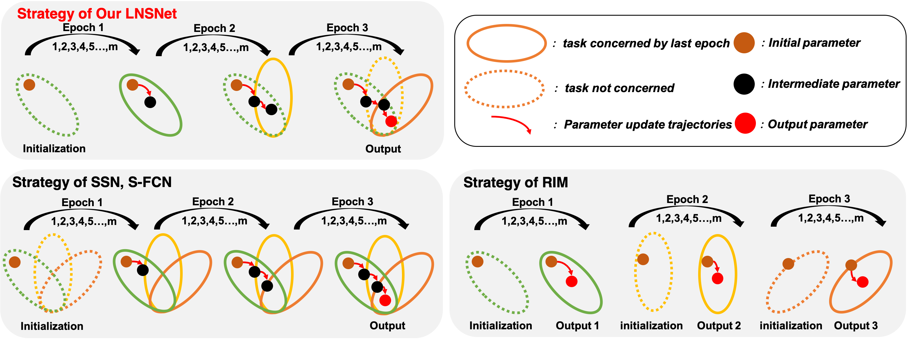
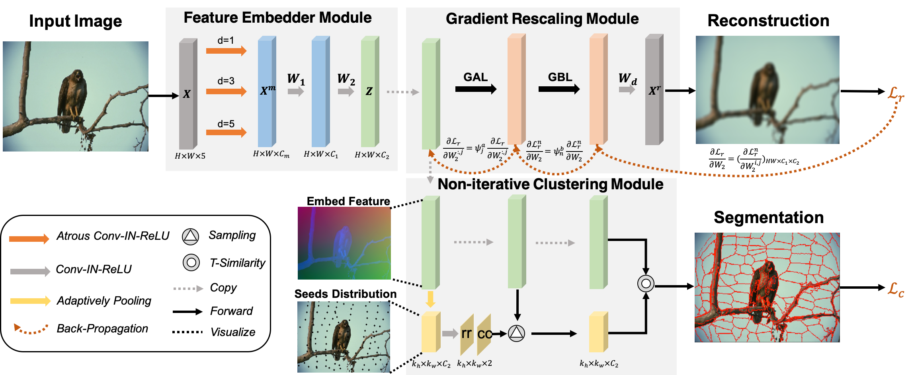
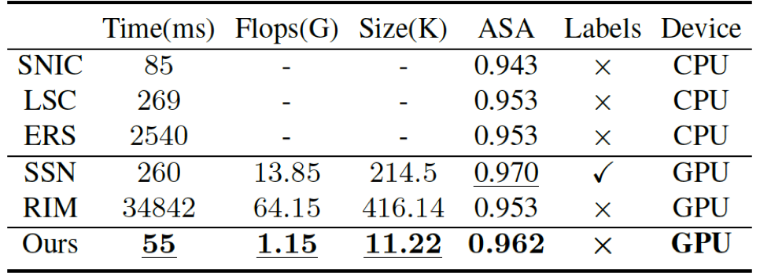

# LNSNet

Official implementation of [Learning the Superpixel in a Non-iterative and Lifelong Manner][arxiv] (CVPR'21)

The proposed LNSNet views superpixel segmentation process of each image as **an independent pixel-level clustering task** and use **lifelong learning strategy** to train the superpixel segmentation network for a a series of images.

[arxiv]: https://arxiv.org/abs/2103.10681

The structure of proposed LNS-Net shown in Fig. 3 contains three parts: 

1) **Feature Embedder Module (FEM)** that embeds the original feature into a cluster-friendly space; 
2) **Non-iteratively Clustering Module (NCM)** that assigns the label for pixels with the help of a seed estimation module, which automatically estimates
the indexes of seed nodes;
3) **Gradient Rescaling Module (GRM)** that adaptively rescales the gradient for each weight parameter based on the channel and spatial context to avoid catastrophic forgetting
for the sequential learning.

## Getting Started

Here we only release the model trained on BSDS dataset and corresponding code to utilizes it for superpixel segmentation. The whole training code will be coming soon.

To uese the given model for superpixel segmentation:

'
git clone https://github.com/zh460045050/LNSNet

cd LNSNet

sh runDemo.sh

or

python demo.py --n_spix $num_superpixel --img_path $input_img_path --check_path lnsnet_BSDS_checkpoint.pth
'

